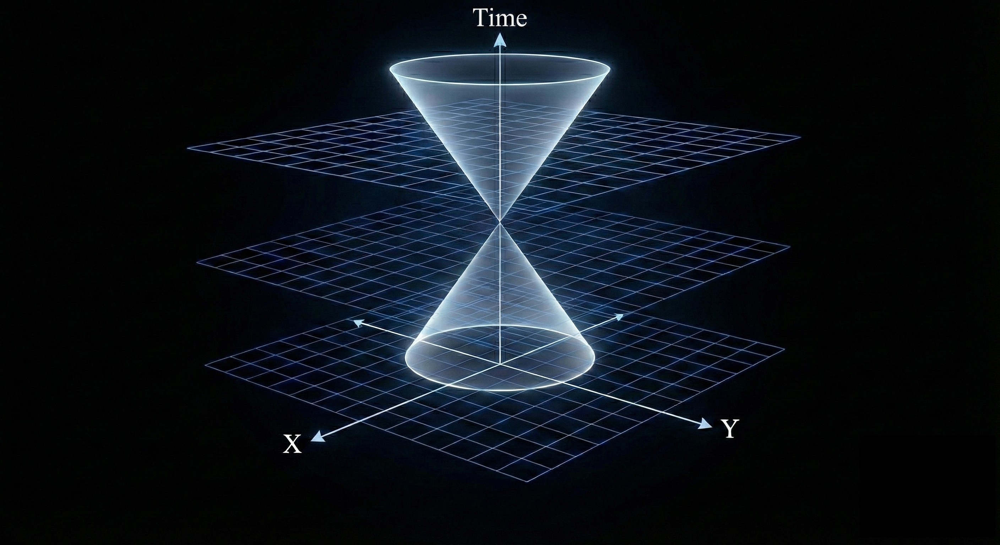

# spacetime 

learning algorithms for video tasks. 

## Models

The following is a list of models implemented in this repository. For each model trained, there is a corresponding training log directory in the `training_logs` directory.

- [Genie](src/spacetime/models/genie): Generative Interactive Environments, Bruce et. al. 2024 [training logs](training_logs/genie)
  - [Model](src/spacetime/models/genie/model.py): Model implementation -- wrapper that puts all the components together for joint training 
  - [Dynamics Model](src/spacetime/models/genie/dynamics.py): Dynamics model implementation
  - [Latent Action Model](src/spacetime/models/genie/latent_actions.py): Latent action model implementation
